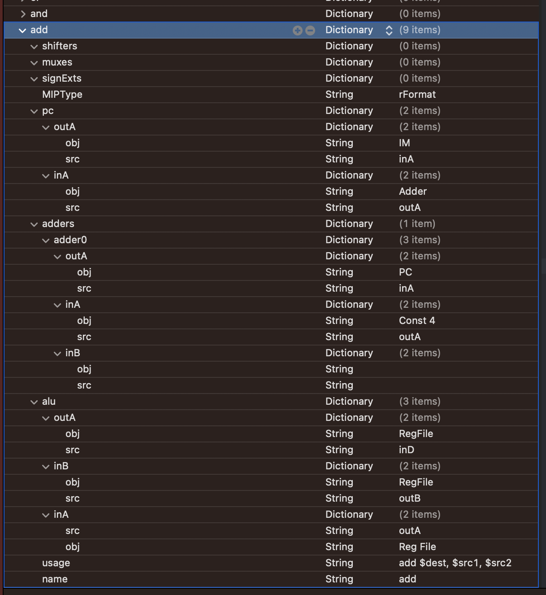
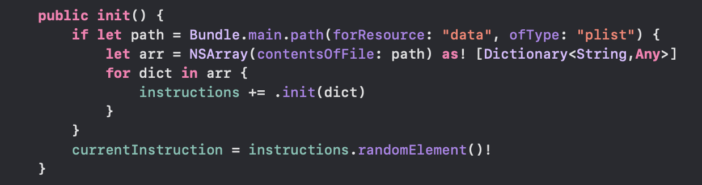
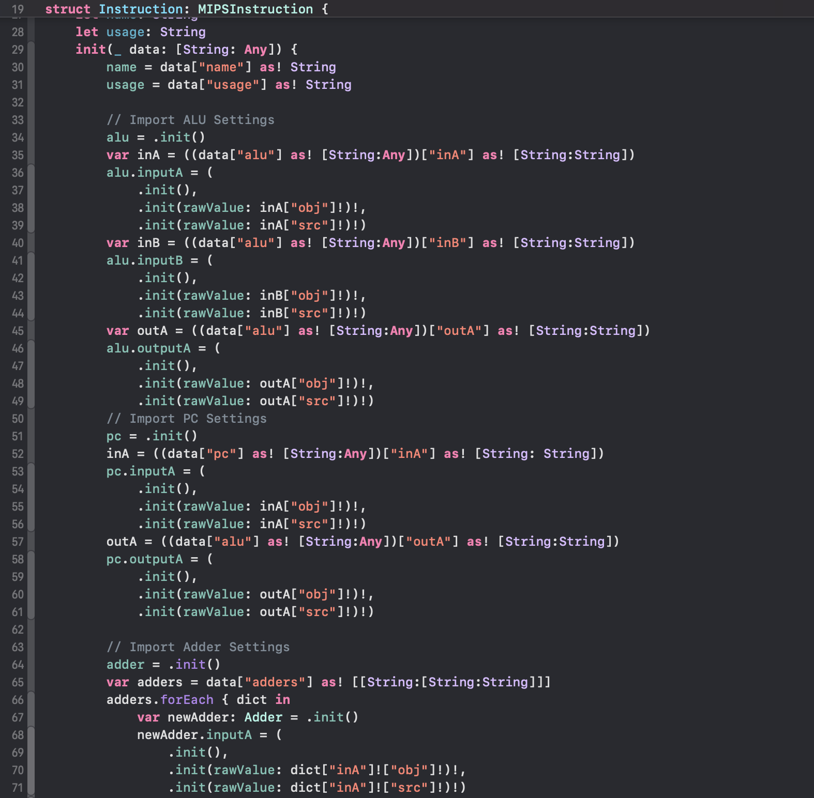
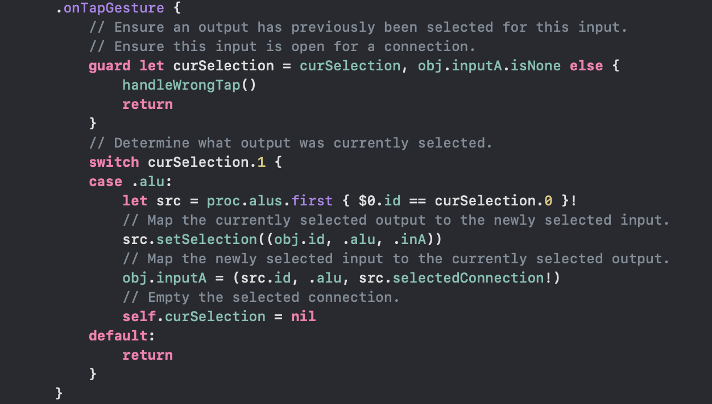
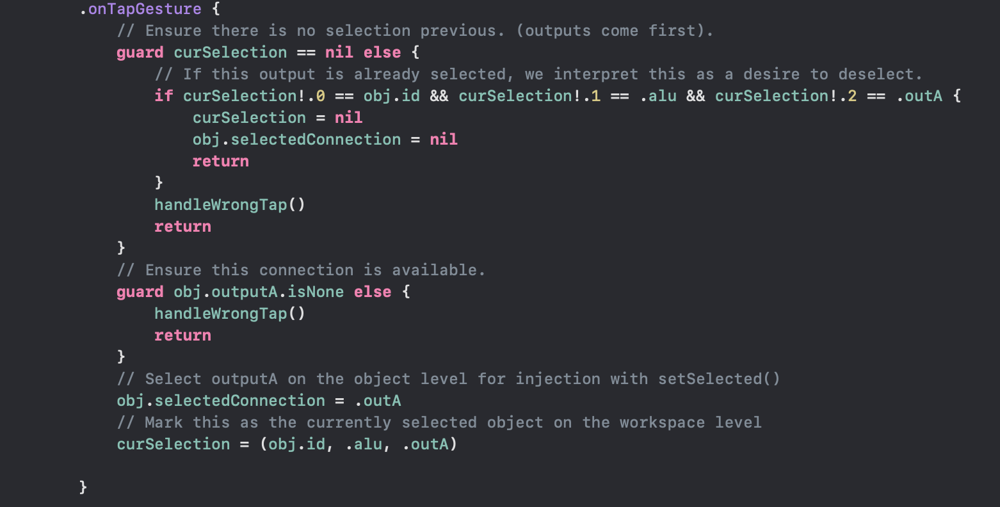
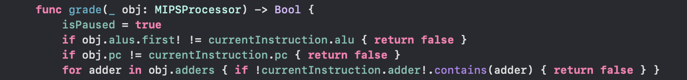
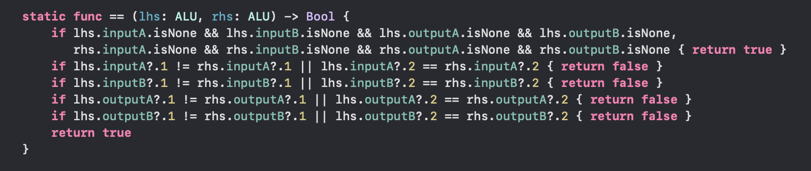

#  MIPS Datapath Simulator Game

## Background & Summary

Earlier this semester, we set out to create a mobile iOS game to facilitate learning the MIPS datapath for a variety ofinstructions. 
Learning from common experience and popular studies (like the one completed at Texas A&M University regarding Calculus), 
we believed that a fast-paced, dynamic gameplay would be the best way to achieve this goal. 
As such, we worked this semester to build a MIPS simulator built around the concept of dragging elements onto a 
workbench before connecting them together appropriately in a given length of time.

From the beginning, we knew that this would be a grand task that would take a broad scope of planning and general knowledge to carry 
out. Due to the nature of the MIPS ISA’s core instruction set being 58 instructions, we knew that we would be unable to complete a 
full one-to-one simulator. Consequently, we were unable to successfully complete the full implementation of all instructions in our 
application. 
    
Perhaps the biggest shortcoming of our application is the user interface. Despite setting out with the best intentions, working out 
the geometry for scaling and zooming a dynamic MIPS datapath is a massively complex task. Furthermore, given the free-place 
nature of the elements, the geometry involved in computing proper paths for connections between elements without colliding 
with other objects proved to be a nearly impossible task. As such, we chose to focus on the UI for a single datapath element: the 
ALU. Placing a single ALU on the game workbench within a game, a player is able to test all of the key connection functionalities 
of the game:
  
  1. Input connections cannot be selected prior to another output being selected.
  2. An output cannot be connected to another output.
  3. An input, once connected to an output, retains its connection, and it cannot be connected to another element.

Because the state of the UI makes the inner mechanics of this game effectively un testable, this document provides a walk through 
of the mechanisms at play in simulating the MIPS architecture, providing input validation, and for verifying accuracy of answers at
the end of a game.

## Game Architecture

The architecture of our game relies on a simplified react-style MVVM structure. There are three core components to gameplay: 
`GameSettings`, `GameManager`, and `MIPSProcessor`. These three objects contain all state data relating to the game at any 
point in time. 

Within the processor, additional data structures are created and maintained for each kind of datapath element in order 
to facilitate tracking of individual connections within a given component. Each data structure maps to a corresponding 
DataStructureView (eg. `ALU` -> `ALUView`) object that handles displaying that element at all points during the game. 
Using a select group of publishers, state changes are updated to all components of the view hierarchy simultaneously. 

`GameSettings`, maintained in the corresponding object, are only able to be modified before the game is started.
Most game settings at this time are related to timing, but there is much potential for future expansion in this department.

Finally, the `GameManager` object controls the verification of the datapath. When the game board is generated, the `GameManager` is 
called to produce an appropriate instruction from the predefined bank of instructions. To facilitate expandability, the manager 
reads an internal property list to get details regarding each instruction. These details are dynamically mapped into an 
`Instruction` object for comparison. This object contains an object in the correct predefined state for each component in the 
datapath to facilitate easy comparison at the point of grading. Once the timer runs out, or the stop button is hit 
(whichever comes first), grading occurs and the instruction is recycled.

Ideally, there would be a fourth state object to identify players and manager scores and other data across multiple sessions. At 
this moment, this functionality remains unimplemented.

## Code Snippets

In the following sections, various techniques used internally within this game to model and validate the datapath are explored in 
more detail. This section is to provide more detail behind the mechanisms that are unable to be tested by the application in its current
status.

### Instruction Encoding

To facilitate the expandability of this game, each correct answer is codified inside the game's `data.plist` file. The nested dictionary structure
provides key details for each element of the datapath, along with the corresponding usage and name, in a way that can be read programmatically:

 
    
Instruction Encoding

    
  

Once instructions have been written out in this manner, the process of creating a new `Instruction` is fairly straight-forward:

 
    
Instruction Importing

    
  

The whole process of loading individual instructions, and subsequently selecting an instruction to use within the program, is carried out
within the `GameManager` at initialization time, making gameplay very quick at the expense of a slight increase in load times.

 
    
Instruction Import Management

    
  

### Input Handling

Although the UI itself is not complete, the functionality behind selecting and completing connections is functional! Each connection on a datapath element
is represented internally with its own tuple containing the relevant destination data. Therefore, handling inputs is quite simple for both inputs and outputs:

 
    
Input Handling - Input Connections

    
  

 
    
Input Handling - Output Connections

    
  

Due to the reactive style of the game, merely modifying these connection variables is enough to trigger UI updates that redraw the UI appropriately, with the new
connections added. 

### Grading
At the finish of the game, the `GameManager`'s `grade()` method must be called to evaluate the status of the `MIPSProcessor`. This function is fairly trivial, going through
each datapath component group and calling the `==` operator.

 
    
Grading

    
  

Each component of the datapath has an overload of this operator to enable custom comparison of the specific component pieces required for a given instruction:

 
    
Testing For Equality

    
  

Although not completed to the scope required for a full scale implementation of the datapath, due to timing and complexity constraints, this is a robust grading system that is setup to handle all varieties of MIPS instructions.

## Conclusions
Although this application did not get to the level of completeness that our group initialially set out to obtain, we firmly believe that this application has a strong base in reality, provides a vast range of knowledge (through the datapath hints tools) and is more than capable of being expanded to support future students in their datapath endeavors.

--
Carson Rau, Dillon Fleharty, Rene Carbajal
